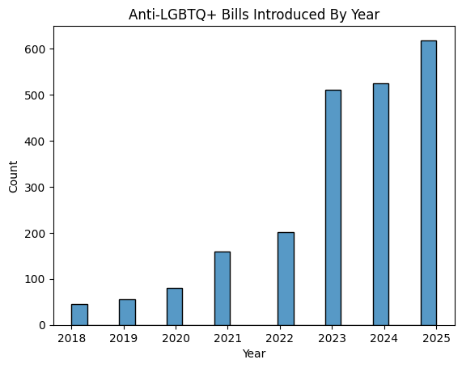
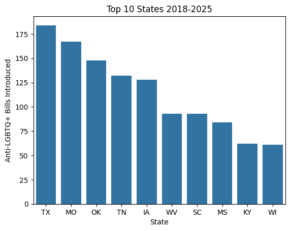
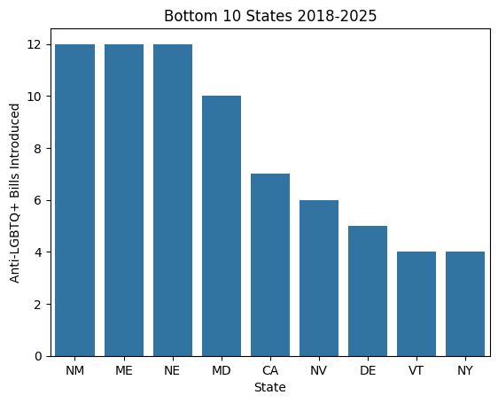
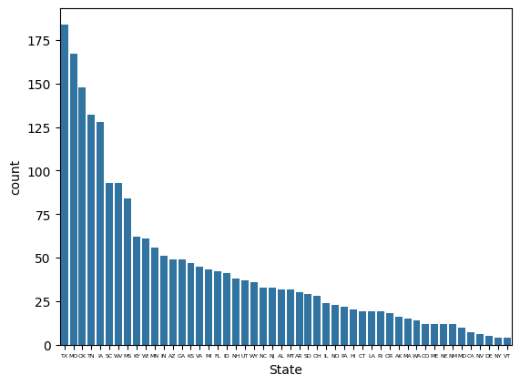
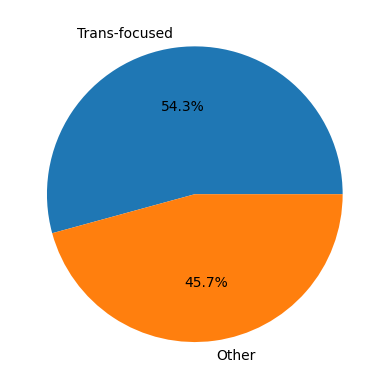

# Problem Definition
In the United States and abroad I've noticed a steady increase in top-down anti-LGBTQ+ sentiment. This is to say that it's a project by those who hold power, not the everyday individual. I'd seen reporting that this mostly coincided with the 2021-2022 election cycle, with trans rights as a specific target. In setting out on this project I sought to answer two questions, with a bonus one if time allowed: How has the amount of state-level anti-LGBTQ+ legislation changed over time, where, and to what effectiveness?

# Data Description
When looking for datatsets I found [this excellent table](https://doi.org/10.25949/24190026) by Dr. Tiffany Jones of Macquarie University. It is a compilation of anti-LGBTQ+ bills introduced into state (and Puerto Rico's) legislatures through 2018 to 2025, with a basic description of the bills targets and progress. Keep in mind that this is _state level_, so neither federal legislation, executive orders, nor court decisions will be represented here. Here's a screenshot of the first row, for reference:

You can see that the 'Form' column provides a category of the bill's impact, while the 'Status' column has a brief summary of its status. Both of these columns are tricky because they don't adhere to a consistent format throughout the the set—any working with those columns will require working with keywords.

Now a caveat: I am not familiar with Dr. Jones and have not personally verified that this data is comprehensive. It is possible that she made a mistake or that her judgement of what qualifies as anti-LGBTQ+ is flawed. She does specialize in LGBTQ+ policy but is located in Australia, so her familiarity with US state governments may be lacking as well. All in all, this data may underrepresent reality.

# Data Cleaning & Preparation
The nature of this data meant that cleaning was not much of an issue. All of the information is public records with no sensitive or identifying qualities. There were no missing values and everything in the set was relevant to the topic—apart from the inclusion of Puerto Rico. I'm not familiar with Puerto Rican government and decided to stick to just US states. I dropped every row from Puerto Rico, but there were only 3 to begin with.

The main difficult part here was getting the data in a format agreeable to Python and Pandas. The way tht the data is gathered in a table and separated by year, along with the fact that it's in a .docx file, meant that I had to do some work before getting into VSCode. I copied the data in a spreadsheet and added a new column, 'Year', so that I could have everything sorted without repeat columns.

# Data Understanding & Visualization
The first thing I wanted to explore was if my hypothesis—that anti-LGBTQ+ legislation has significantly increased, and if so coinciding with election cycles—was true. To do that I created a histogram showing the amount  introduced over time.

And it seems like my hypothesis was correct. Numbers are somewhat insignificant from '18-'20, but double for the '21-'22 cycle. They rocket again for the next cycle, then noticeably shift for the next. I'll get to what this might mean in the next section, but whoof. This is grim.

I next wanted to look at the state level. Where was it the worst, and where was it the best? To do this I created count plots of the top 10 for each respective end of the spectrum. For reference, the total number of bills is 2,199.

 

Some of what you see here might line up with what you expect, but I personally was surprised to see Wisconsin in the top and Nebraska in the bottom. Of course, it's also supremely disappointing for no state to be at 0. Once again, deeper interpretation is for next section. Below is a plot with every state on it; it's messy to read and not something I initially intended to include, but I accidentally made it then figured it may be of interest.

I'd love to go deeper on the status of the bills, but dealing with the author's inconsistent descriptions meant that I couldn't be confident I could provide a fully-accurate depiction. Instead I moved on to my sub-question; how have trans rights, specifically, been represented here? I return once again with a plot based on years, this time focusing on bills the author classified with these phrases: "Single-sex", "TGD" (shortening of "transgender"), and "ID" (as ID laws are meant to target transgender individuals). This may not be a completely comprehensive capture, but it's the way the author classified the entries.

You can see that this follows the general trend with anti-LGBTQ+ bills overall, apart from the conspicuous dip in 2024. For reference here, the total number of anti-trans bills represented here is 1,193—that's over 54% of anti-LGBTQ+ bills overall! Here's a quick visualization to let that sink in:

# Storytelling & Interpretation
So it seems abundantly clear that anti-LGBTQ+ action amongst politicians has been on a noticeable rise, with a heavy focus on transphobia. It started out at a negligible amount in 2018, which echoes anecdotal sentiment I've heard that queer and trans people thought things were substantially improving and that their lives could be normalizedaround that period, only for there to be a noticeable jump in bills starting in 2021 and happening again every 2 years. The most obvious explanation here is that this coincides with election cycles; bigoted politicians see attacking LGBTQ+ rights as a way to score approval among their base, so they introduce legislation as a demonstrable proof of their commitment to those views. I personally view it as a desperate last-ditch effort by a group that knows their influence and world-views are declining, but this is not something that I'm prepared to back up with data.

I would also like to talk about the concentrated effort to quash trans trights. Just like the broader LGBTQ+ community as a whole, their situation was relatively unthreatened as of the mid-to-late 2010s. This has very noticeably changed now, what with 24 states deemed as being a moderate or higher risk to live in for trans people, according to journalist Erin Reed (2025). North Carolina's own HB2—which mandated transphobia for government bathrooms, met massive outcry, and was arguably a large factor in governor McRory's failed reelection bid (Dalesio & Drew, 2017)—is now the law in 16 states with 5 more having almost-as-severe ones in place (Movement Advancement Project, 2026). This definitely seems like a focused political project, and not one that's just limited to the US. The United Kingdom has, in most aspects, shifted even harder against trans rights—and they are under an ostensibly left-wing government. Where politicians were fine with them before, trans people's rights are now frequently employed as a wedge issue and scapegoat for larger problems. It's depressing, to put it plainly, and I'm not even personally affected.

# Limits, Ethics, & Reflection
As noted at the start, this data does not capture other forms of law that could impact LGBTQ+ rights, like court decisions or federal action. State-level and national politics can have very different dynamics, so it may be risky to extrapolate this data to how the country as a whole feels—though this does feel like the relevant time to inform you that the first national piece of anti-LGBTQ+ legislation made law since the 90s was passed by a Democrat-controlled Senate and signed by Joe Biden, the NDAA 2025.

But on that note, while the numbers here may seem despairingly high, many bills are introduced without any expectation that they'll actually pass. This is a limitation of my project which I would have loved to delve into more. Only a fraction of bills introduced actually get signed into law, with most dying in subcommittees or actively getting rejected by the legislature or governor. This is likely why every state has at least some bills on the list; conservatives in solid blue states introduce these to get attention, not to actually implement them. If I had the time and knowledge I would have included representations to show how much of an issue these bills really are and to what extent the one's that passed have increased. Unfortunately, the inconsistent way the author filled in entries made that unfeasable for me to pursue.

This data comes without any conceivable ethical issues nor room for bias—apart from the previously mentioned potential for the author to miscompile the data based on her judgement. The data being entirely categorical meant that I struggled to think of ways to diversify my visualizations, though it was a fun challenge to do something like this where numerical data was not an option.

# Code
[Jupyter notebook here](https://github.com/dylanCoat/modelingandsociety.github.io/blob/main/docs/assets/Project_1_Anti-LGBTQ%2B_Legislation.ipynb))

# References & AI Use Transparency
No AI was used at any point in the making of this project.

Dalesio, E. P., & Drew, J. (2017, March 30). _AP Exclusive: ‘Bathroom bill’ to cost North Carolina $3.76B_. The Associated Press. https://apnews.com/article/e6c7a15d2e16452c8dcbc2756fd67b44

Jones, T. (2025, October 30). _Proposed Anti-LGBTQ+ US State Bills 2018-2025_. Macquarie University. https://doi.org/10.25949/24190026

Movement Advancement Project. (2026, February 23). _Bans on Transgender People Using Public Bathrooms and Facilities According to their Gender Identity_. https://www.lgbtmap.org/equality-maps/nondiscrimination/bathroom_bans

Reed, E. (2025, August 29). _Anti-Trans National Legal Risk Assessment Map: August Edition_. Erin In The Morning. https://www.erininthemorning.com/p/anti-trans-national-legal-risk-assessment
