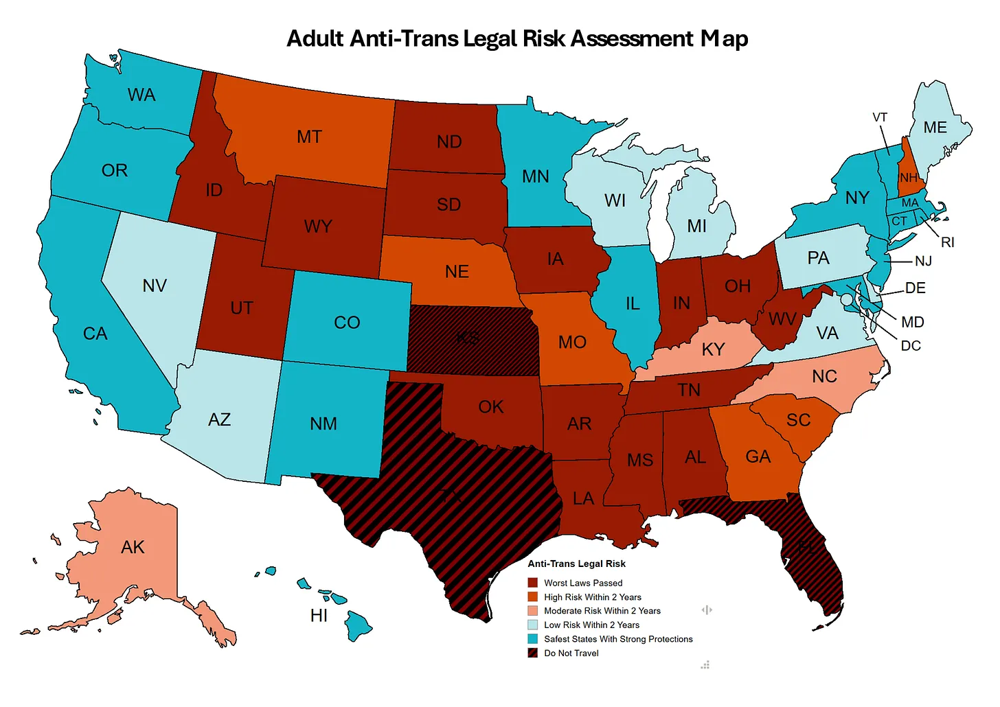

# Project Intro
Building off of my last project, I wanted to examine potential causes behind why some states are worse than others with regards to transgender rights. To do this I compiled basic political information about every state, like their governor's party, legislature's dominant party, 2024 president vote, and more. And while transgender rights exist on a continuum, I needed a binary measure. I once again used Erin Reed's (2026) [Adult Anti Trans Legal Risk Assessment Map](https://www.erininthemorning.com/p/anti-trans-national-legal-risk-assessment-a5d), seen here:

I separated it into two categories. Every state deemed high-risk or worse is categorized as high-risk in my data (amounting to 24 states), while all else is not high-risk.

# Findings
To try to weigh the importance of each variable, I used a decision tree. A decision tree decides the most important variable and splits the data according to it, then repeats the process with different variables until each path all belongs to the same category. You can see the results of my most accurate tree here:

Keep in mind that this is true for 40 states; the final 10 are reserved to test the model's accuracy. Essentially what this is saying is that of my variables, the most important one is which party controls the state's government. States with Republican control (and Nebraska, which is ostensibly non-partisan) all are high-risk states. The only state to be high-risk but not controlled by conservatives is that which has a Republican legislature and a population below 3,792,042 (an arbitrary threshold). But before I talk more about the results here, we need to first be aware of how accurate this model actually is. With the final 10 states, all but 1 were correctly categorized by the tree. That's pretty good, but then again there being only 50 states mean that it's pretty easy for a model to do well. Disappointingly, this model tells me no insightful information. Of course total control of the government is important. The only interesting thing here is the final step, where it separates what makes a Republican legislature pass these laws, but even there it could just be coincidence that the least-populous state of the 5 happens to be the only one high-risk.

I decided that perhaps state control was too obvious of a varaible and wanted to see how a tree would look without it. I tried another tree removing that variable, while also increasing the amount of states reserved for testing the model. Here is the tree that formed:

This one seems more complicated, so I'll walk you through it. The left part shows that of all states with a Republican governor, those that also have Republican legislature are high-risk while the others are not—very similar results to the first tree. On the right path is states with a Democratic governor; of those, all Democratic legislatures are not high-risk, while the Republican ones are only high-risk if they have a population below what should be a familiar number... Despite randomization of what states it was trained off of, this is basically the same tree. It's technically rated as more accurate, with a score of 92.308% compared to the previous's 90%, but really both trees only have a single state that's not applicable.

For the full breakdown on the technical side of things, see [here](project2technical.md).

# Reflection
Overall the results here are underwhelming. Before doing this, I could've guessed that some of the most important factors would be the party of the governor and controlling the legislature. I fail to think that even including more factors would've created a more interesting result, as the former 2 are just so determinative. I _was_ surprised to see that the courts never came up in any of my final or testing trees. One could posit that that's because the courts are a much more hierarchical system, so pair that with the U.S. Supreme Court being expressly transphobic—see last week's Chiles v. Salazar, for example, an 8-1 case deeming bans on conversion therapy to violate free speech (Trevor News, 2026)—and it makes sense that the courts have little impact.

My main takeaway from the actual act of doing this project is the importance of sample sizes. I went into it thinking that since the sample size was enough to be statistically significant, surely it could work for machine learning. To degree to which it did is debatable but nonetheless I expected a more robust and interesting tree, the kind of which of forms from much larger and diverse datasets.

# Works cited
At no point was AI used in the making of this project.
### Dataset
Ballotpedia. (2025, November 4). _State supreme courts_. https://ballotpedia.org/State_supreme_courts#sscinfo-listofcourts-1

Flores, A. R., Herman, J, L., Gates, G. J., & Brown, T. N. T. (2016, June). _How Many Adults Identify As Transgender In the United States?_ The Williams Institute. https://williamsinstitute.law.ucla.edu/wp-content/uploads/Trans-Adults-US-Aug-2016.pdf

National Conference of State Legislators. (2026, March 23). _State Partisan Composition_. https://www.ncsl.org/about-state-legislatures/state-partisan-composition

Reed, E. (2026, February 20). _Anti-Trans National Legal Risk Assessment Map: Feb 2026_. Erin In The Morning. https://www.erininthemorning.com/p/anti-trans-national-legal-risk-assessment-a5d

### References
Reed, E. (2026, February 20). _Anti-Trans National Legal Risk Assessment Map: Feb 2026_. Erin In The Morning. https://www.erininthemorning.com/p/anti-trans-national-legal-risk-assessment-a5d

Trevor News. (2026, March 31). _Chiles v. Salazar: What you need to know about the U.S. Supreme Court case on conversion therapy_. The Trevor Project. https://www.thetrevorproject.org/blog/chiles-v-salazar/
