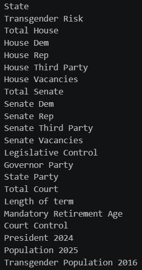
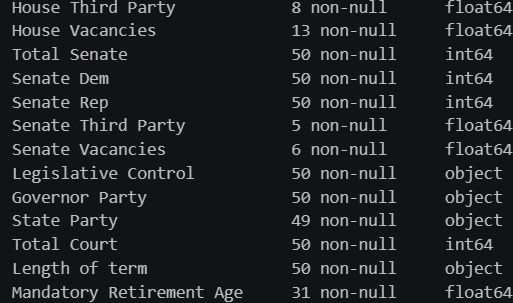
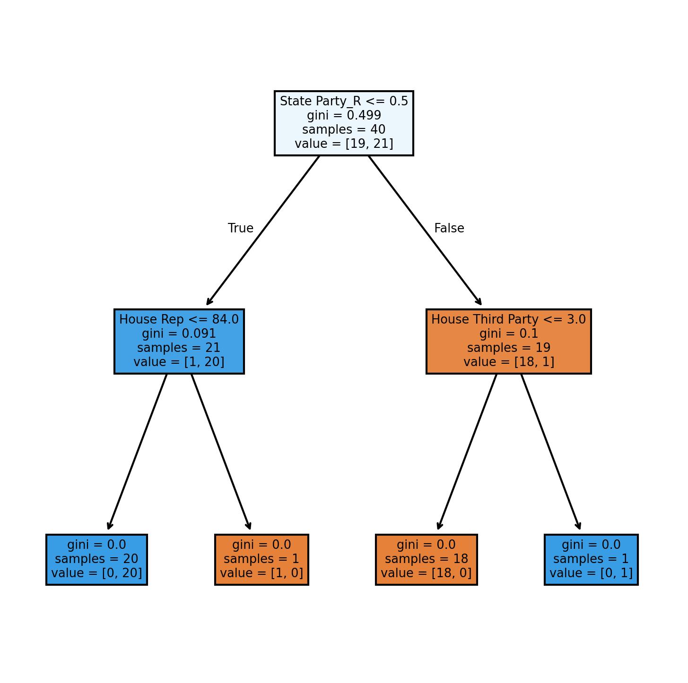
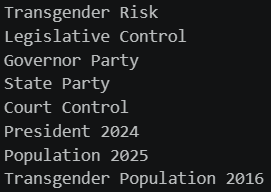
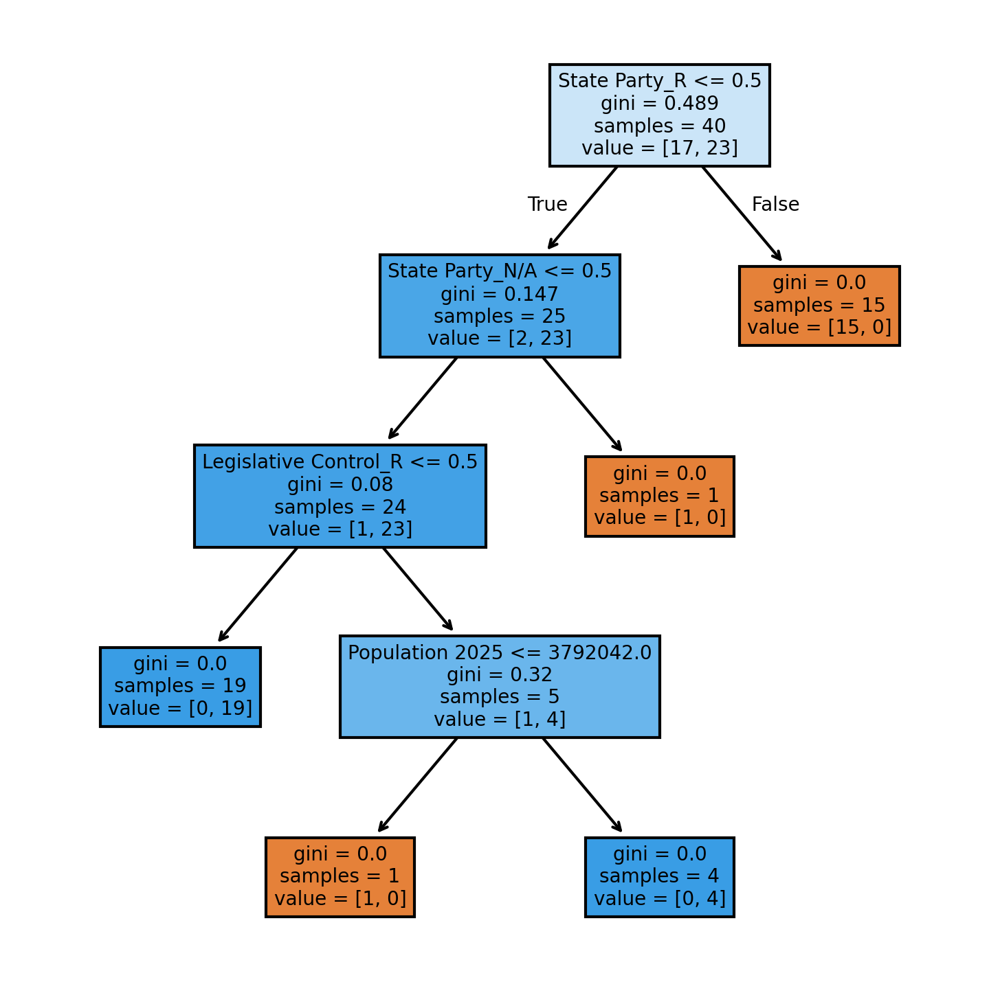
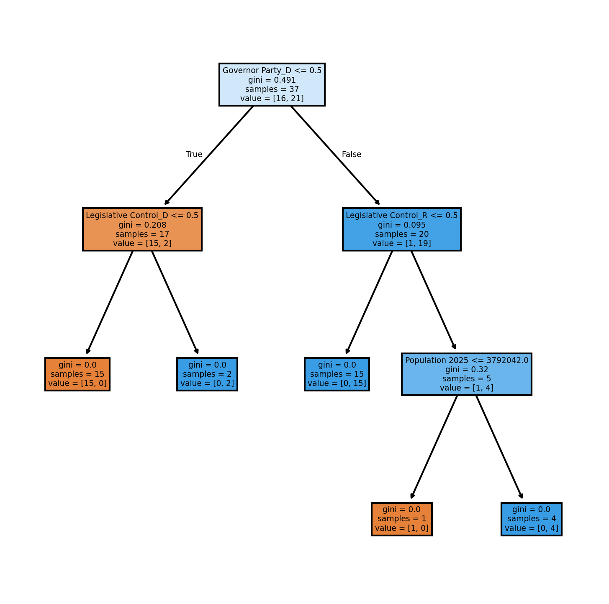

View the code [here](./docs/assets/proj2/Project_2_Trans_Risk.ipynb)
# The Dataset
Ultimately I wanted to gather up several political and social factors in order to explore feature importance for what caused a state to be high-risk to transgender people. The dataset is comprised of several sources that I put together, you can find them at the bottom of this page. The file for the full data can be found [here](./docs/assets/trans_risk.ods) but below is a screenshot of every column name:

A lot of this data, like the Mandatory Retirement Age column, is stuff that I never intended to use. It came with the data I was trying to find, so I figured I may as well include it and let the model sort through what matters. As you'll see, this was not a good idea. I stuck with a decision tree as my model throughout the entire project. I liked that you could see what features it was evaluating off of, as well as it reporting the step-by-step importance rather than overall.

# The Workflow
The data was already organized properly due to myself being the one to compile it in a spreadsheet. The first step here was to handle null values.

The Mandatory Retirement Age's nulls were because no retirement age existed, so I set those to 999. I wasn't going to do math with that column, so any value getting across the idea that it was limitless would do the job. State Party's null is because Nebraska was marked as "N/A" and that was swapped for null upon importing; all I had to do was change it back. The rest of the nulls are from cells being empty when their value represented 0, so a simple replace to 0 for them has every null fixed and my data ready to work with.

Because I was going to still be adjusting columns as I went, I kept dummied dataframes separate from the original. I used one hot encoding for every categorical variable, then divided the data between my y and X. Next I split my training and testing data—reserving 20% to testing—made the tree with default parameters, then took a look at the result.

Here's where multiple issues come in. My dataset is so small that the model's able to take lazy shortcuts, and that's what happened here. Governor happened to be the deciding factor for almost all of my training data, and then it could just arbitrarily pick other features to separate the mavericks. This was something I'd have to manage in my next steps. I also tested the model's accuracy, which it got 80%. Given that my data was nearly a 50/50 split on the y I figured that I didn't have to monitor precision or recall here.

My next step would be to trim down the features to ones I deemed significant.

If you're savvy (or paid attention to the pubic section) you'll spot two issues with using these features, but it would take this next experiment to figure it out myself. I once again went through the process of getting the data ready for the tree then made the second still with default parameters.

I went over my main feelings towards the tree in the public section; to remind you, I thought it was too simple and it had an accuracy of 90%. 

Seeing how the small data size was impacting the model, I also wanted to look at the models' accuracies through cross validation. I used 10-fold cv as it appeared to be the standard for less-intensive models that could handle that many. The first received an accuracy of 86% while the second got 88.00%. Pretty close, disappointingly, but it is interesting that less features made for a more accurate tree. I think this again came down to data size; both models performed pretty well, but the individual trials of tree_2 makes it seem like it was able to stay more consistent.

For the next step it's time to once again address what features I was using. State Party and Population are basically restatements of features I already have included; State Party is a logical combo of Legislative Control and Governor Party, while Population and Transgender Population should theoretically be directly correlated. In my quest for an insightful, interesting model I dropped State Party and Transgender Population (ideally I would've dropped Total Population instead of Transgender Population as the former's less relevant, but I didn't like that the latter was nearly a decade older than the rest of my data). Next it was time to make the tree. This time I reserved 25% of the data for testing, which would hopefully be offset by me also setting the tree's parameters to min_samples_leaf=2. The goal here was to prevent the tree catering to outliers (Nebraska) and making lazy decisions. What actually ended up happening was the tree being unable to fully resolve, with it ending in leaves which contained opposite y values. This felt like the most unsatisfying result yet, so I switched the tree back to default parameters and got this:

I discussed this one in the public section as well—it's basically the same as tree_2. To add insult to injury, I also computed its cross-validation score anf received 86%, the same as first_tree.

# Reflection
I learned a lot about pitfalls with machine learning. Get. That. Sample. Size. Up. I'm honestly not sure if I could've used this data in a tree for a better result—I'm thinking a different approach entirely would've been better suited to my research question. I really had a difficult time coming up with a topic for this project, as every research question I had lacked a suitable dataset and every dataset I found lacked a story I wanted to tell. I wished this project had gone a better direction, but I'm still happy with the work I did and the throughline between project 1 and this.

# Works Cited
At no point was AI used in the making of this project.
### Dataset
Ballotpedia. (2025, November 4). _State supreme courts_. https://ballotpedia.org/State_supreme_courts#sscinfo-listofcourts-1

Flores, A. R., Herman, J, L., Gates, G. J., & Brown, T. N. T. (2016, June). _How Many Adults Identify As Transgender In the United States?_ The Williams Institute. https://williamsinstitute.law.ucla.edu/wp-content/uploads/Trans-Adults-US-Aug-2016.pdf

National Conference of State Legislators. (2026, March 23). _State Partisan Composition_. https://www.ncsl.org/about-state-legislatures/state-partisan-composition

Reed, E. (2026, February 20). _Anti-Trans National Legal Risk Assessment Map: Feb 2026_. Erin In The Morning. https://www.erininthemorning.com/p/anti-trans-national-legal-risk-assessment-a5d
