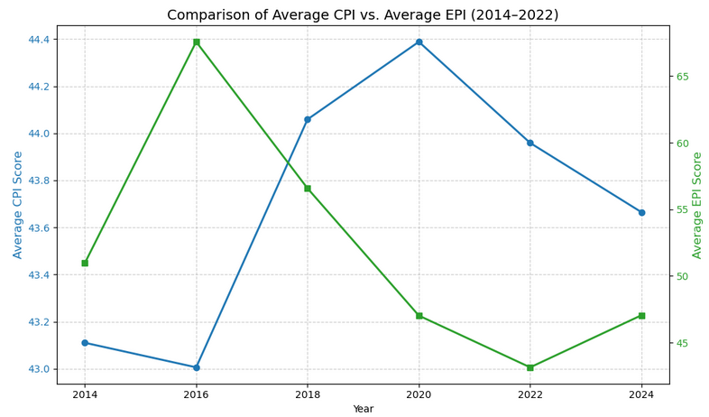
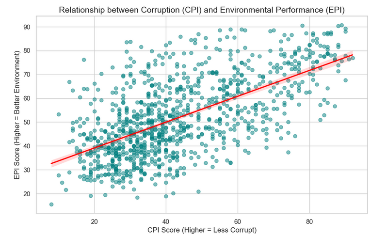
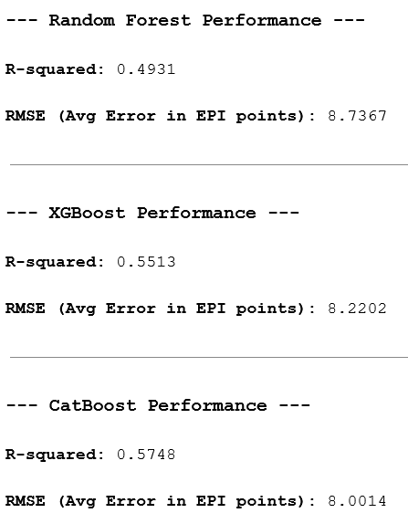
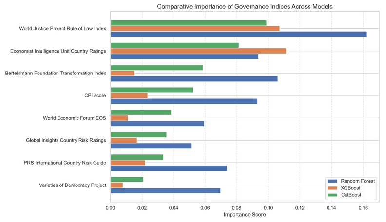

## Introduction
This section is meant as a more in-depth explanation of the work showcased in the public section. As such there will be some restating of information.

## Data Preprocessing and Assumptions
When we processed the CPI we used a copy of the raw data to make non-perminant changes. The first thing we did with the copy was dropping all columns that had more than 35% null value points. This allowed us to deal with features where most of their observations were observations provided by the CPI and not manufactured by us. The next thing that we did was standardize the names in the CPI to match those in the EPI. For example, the United States of America vs the USA. This is going to help in the long run once we merge both the indices into one dataframe.

When we started processing the EPI, we imported each of the seven individual CSV files and did identical cleaning for them. The cleaning started with making a copy of the raw CSV with only the necessary columns: ‘Country’ and ‘(year) EPI Score’. Next we renamed the EPI Score so that the year was not included in the feature name. This would make the CSV merging easier in the future. Afterwards, we added a year-based timestamp so that we are able to identify what year the datapoints came from once we merge all the EPI CSVs into the same dataframe. Then we are finally able to combine all the individual EPI dataframes into one big dataframe that consists of observations from 2014 - 2024.
  
Once we processed both of the indices, we made sure that both had the correct amount of unique countries. This makes sure that one index is not larger than the other. We are then able to merge both the indices into one dataframe. The last preprocessing step that we did was to drop columns we deemed irrelevant which were: ‘ISO3’, ‘Rank’, and ‘Number of sources’. All of those columns were information that was not needed for our machine learning needs. 
  
For our EDA, we focused on establishing the relationship between CPI and EPI, as it would strengthen our assumptions on how the specific indexes would impact the environment. We made two visualizations that we could draft assumptions from, the first being a comparison between the average CPI and EPI score over the time period of the study.

The graph indicates an interesting relationship between CPI and EPI. On the surface, it seems that CPI and EPI may seemingly have an inverse relationship, but that is where understanding how the environment responds to corruption can help explain this graph. High corruption will not immediately harm the environment, it just starts the process towards ecological decline. The environment will take time to show the true effects of corruption, as you can see with the 2016 markers. It’s the highest average EPI recorded, but the lowest CPI recorded. You can see the effect that low CPI score had on the environment in the years that followed, with 2018 and 2020 taking sharp downturns for environmental health. We can see this relationship again in 2020 but inverse, with said CPI score being the highest recorded. We can see the positive effects of this in 2024, where we see upward momentum in environmental health. While nuanced, this graph helps us establish a basic positive relationship between CPI and EPI as well as a way for interpreting the possible lagged relationships. In order to solidify the relationship, we made a scatter line plot, to check for positive linearity. 

The plot establishes a linear relationship, showing that as CPI score increases, EPI also increases. Combining the insights taken from these two visualizations, we can conclude that as CPI increases, EPI is also expected to increase. 

## Model Experiments / Evaluations

For our model experiments, we decided to try Random Forest Regression, XGBoost, and CatBoost models. The models all use decision trees but handle the complexities in the data in different ways. Random Forest builds multiple trees and then merges them together for a final analysis of feature importance. XGBoost builds its trees sequentially, instead of in parallel like Random Forest, thus gaining accuracy through correcting its previous trees. CatBoost is optimized for handling categorical data, which is perfect for picking up on trends that could happen graphically between countries and regions. We decided to use models that show feature importance because the CPI is an index of indexes, so knowing which index score is the most important could help us pinpoint specific types of corruption affecting EPI.

In every model used, we used an initial GridSearch algorithm for optimized hyperparameter tuning. This will allow us to get the best results possible from each model and keep us from doing guesswork. We then ran each model with the optimized hyperparameters for comparison. Our results are shown below. 

The CatBoost model ended up being our highest performer with the highest R-squared value and lowest error rates. The model explains about 57% of the variance in global EPI scores, which is a relatively strong score for the social and environmental fields. 

Despite CatBoost being our highest performing model, we made a visualization to include each model's feature importance, as we felt like valuable insights could be gained from the comparisons. 

From the feature importance comparison, we can deduce that the World Justice Project Rule of Law Index and Economist Intelligence Unit Country Ratings are the most reliable predictors of environmental health. The World Justice Project being of consistently high feature importance suggests that things like government regulation, structural integrity, and judicial strength are important to environmental health. Likewise, the Economist Intelligence Unit suggests that along with structural protections, countries with strong and stable economies are more likely to have higher performing environments. This is likely due to having more resources to be able to enforce regulations to protect the environment. Both of these findings suggest that the effectiveness of regulatory institutions could be more important to the environment than other forms of corruption, or lack thereof. 

### Resources

GeeksforGeeks. “CatBoost in Machine Learning.” GeeksforGeeks, 20 Jan. 2021, 
www.geeksforgeeks.org/machine-learning/catboost-ml/.  

GeeksforGeeks. “Random Forest Algorithm in Machine Learning.” GeeksforGeeks, 22 Feb. 2024, www.geeksforgeeks.org/machine-learning/random-forest-algorithm-in-machine-learning/ 

GeeksforGeeks. “XGBoost.” GeeksforGeeks, 18 Sept. 2021, 
www.geeksforgeeks.org/machine-learning/xgboost/.

### Code Repo

[Code here](https://github.com/p-hall1904/Final-Project/blob/f6d5f786e406efb00337544412fc47afc6ad97fd/Final%20project%20code.ipynb)

### AI Transparency

Claude Sonnet 4.6 was used to help debug and build visualizations. All interpretations were done by us as a group.
